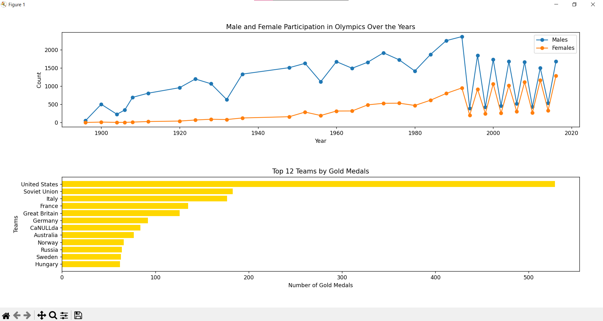

# 🏅 Olympics Data Analysis Project

Welcome to the **Olympics Data Analysis** project! This project analyzes the participation and performance of athletes in the Olympic Games using a MySQL database and Python. By querying data from the `athletes` table, we visualize key insights such as gender participation trends and the top teams by gold medals.

## 🎯 Project Overview

The goal of this project is to provide an analysis of:
- 📊 **Male and female athlete participation** over the years.
- 🥇 **Top teams based on the number of gold medals** won.
- 🔍 Extract useful data from MySQL and create visualizations with Python.



## 🛠️ Tools & Libraries

### 📚 Python Libraries:
- **`mysql-connector-python`**: To connect and run queries on the MySQL database.
- **`matplotlib`**: For creating line and bar plots.
- **`numpy`**: For efficient numerical operations.

### 🗄️ Database:
- **MySQL Workbench**: The primary tool for managing the database schema and running SQL queries.
- **MySQL Database**: The project uses a database named `olympics` with a table `athletes`, which contains all the relevant data about Olympic athletes.

## 📂 Project Structure


- **`olympics.py`**: The main Python script that runs the data analysis, creates visualizations, and fetches data from the database.
- **`README.md`**: The project documentation (this file).
- **`athletes.csv`**: This folder can contain any data related to the project (e.g., backups or exported results).

## 🚀 Setup Instructions

### Step 1: Clone the Repository


```git clone https://github.com/Coconut-X/Olympics-Analysis-Python.git```


### Step 2: Install the Required Python Libraries

Make sure to install the required dependencies using pip:

```pip install mysql-connector-python matplotlib numpy```

### Step 3: Set Up the Database
Import the Database into MySQL Workbench:

Create a new database schema:
sql
Copy code
```CREATE DATABASE olympics;```
Import the SQL dump or data file for the athletes table (if provided). You can do this via MySQL Workbench:
Go to Server > Data Import.
Select the file, choose olympics as the target schema, and run the import.
Verify the Table:

After importing, run the following query to ensure the data is imported:
sql
Copy code
```SELECT * FROM athletes LIMIT 10;```
### Step 4: Update the Python Script with Your Database Credentials
Make sure to update the database connection settings in the olympics_analysis.py script to match your local MySQL setup:

python
Copy code
``mydb = mysql.connector.connect(
    host="localhost",
    user="your_username",
    password="your_password",
    database="olympics"
)``
### Step 5: Run the Python Script
Now, you're ready to run the Python script to generate the visualizations:

bash
Copy code
```python olympics_analysis.py```
The script will:

*Query the database to fetch male and female participation data.
*Visualize the top 12 teams based on gold medals.
*Generate line plots and bar charts to present the data.

# 📊 Data Visualization
### Male and Female Participation Over the Years
This plot shows the participation trends of male and female athletes across different Olympic Games.

### Top Teams by Gold Medals
This horizontal bar chart showcases the top 12 teams with the most gold medals won in Olympic history.

